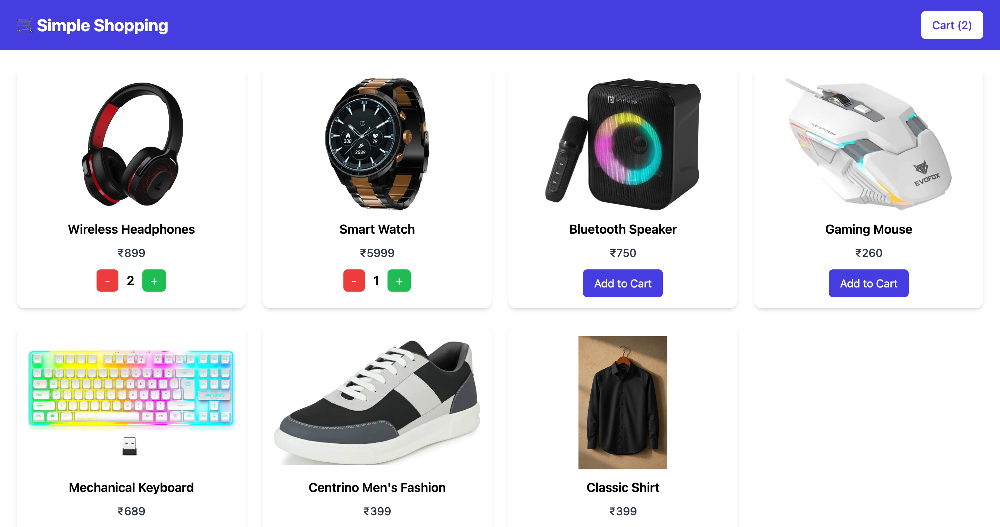
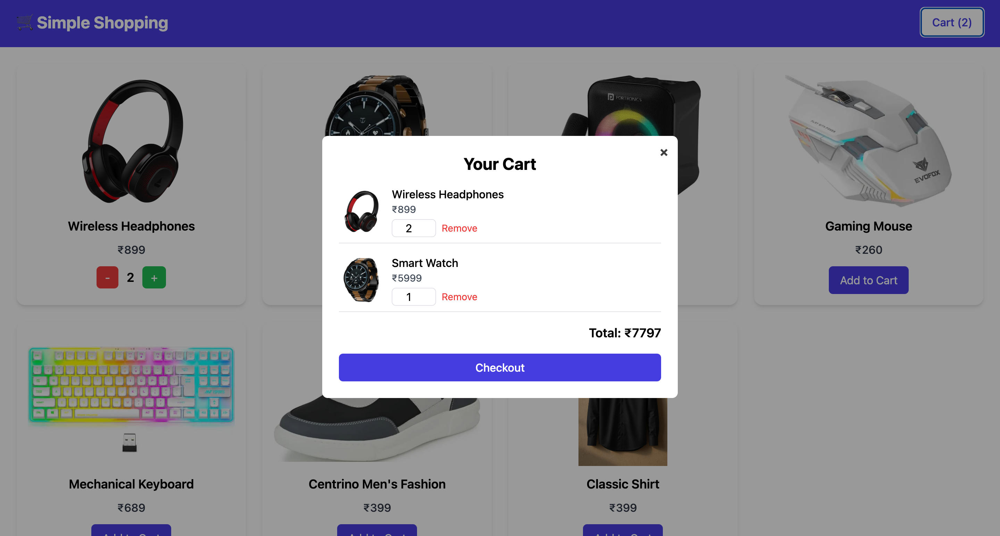

# 🛒 Simple Shopping Cart

[🌐 Live Demo](https://simple-shopping-cart-henna.vercel.app/) 

A **minimal e-commerce web application** built using **React.js**, **Tailwind CSS**, and **Express.js**.  
This project demonstrates how to list products, manage a cart, and simulate a checkout process — all without a database.

---

## 🖼 Screenshots

### Homepage

### Cart Page

---

## 🚀 Project Goal

To create a **simple and responsive shopping cart application** where users can:

- View a list of products
- Add items to the cart
- View the cart summary
- Checkout with a simulated order

---

## 🧩 Features

### 🔹 Backend (Express.js)
- `/api/products` → Returns a **hardcoded list of products** (JSON).
- `/api/checkout` → Accepts a list of product IDs and quantities, logs the order, and returns a **success message**.
- Modular structure with **controllers** and **models** for clean code.

### 🔹 Frontend (React + Tailwind CSS)
- Fetch and display products in a **responsive grid layout**.
- Add items to cart with **"Add to Cart"** button.
- Manage cart state on the **client side**.
- **Cart View** with item details, quantities, and **total price**.
- **Checkout Button** to send cart data to the backend.
- **Responsive Design** for mobile, tablet, and desktop.
  
---

## ✨ Bonus Features

✅ Update item quantity inside the cart.  
✅ Persist cart data in **localStorage** (so cart is not lost on refresh).  
✅ Toast notifications for actions (add/remove).  
✅ Modular React structure using `components/`, `pages/`, and `context/`.

---
Frontend: React.js, Tailwind CSS
Backend: Express.js,NodeJs
Language: JavaScript (ES Modules)
Tools: Vite, Postman, npm

🏁 Conclusion

A clean, minimal, and responsive shopping cart application demonstrating React state management, API integration, and Express backend handling.

⭐ If you like this project, don’t forget to star the repo!

